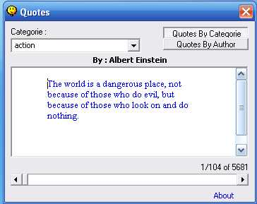



## Wisdom Quotes Text Database \( More Than 5500 Quotes For Free Use \)

### Description

A Quotes Text Database Application Displaying More Than 5500 Quotes From Various Categories And Authors . You Can Use it to Build Quote of the day Applications Plus ADDED a Php Source Code For Web Based Quote Of The Day Readymade.
 
### More Info
 

             |
---                |---
**Submitted On**   |2006-05-04 14:44:56
**By**             |[ajaybnl](https://github.com/Planet-Source-Code/PSCIndex/blob/master/ByAuthor/ajaybnl.md)
**Level**          |Advanced
**User Rating**    |4.7 (28 globes from 6 users)
**Compatibility**  |VB 6\.0
**Category**       |[Internet/ HTML](https://github.com/Planet-Source-Code/PSCIndex/blob/master/ByCategory/internet-html__1-34.md)
**World**          |[Visual Basic](https://github.com/Planet-Source-Code/PSCIndex/blob/master/ByWorld/visual-basic.md)
**Archive File**   |[Wisdom\_Quo199211552006\.zip](https://github.com/Planet-Source-Code/ajaybnl-wisdom-quotes-text-database-more-than-5500-quotes-for-free-use__1-65205/archive/master.zip)

